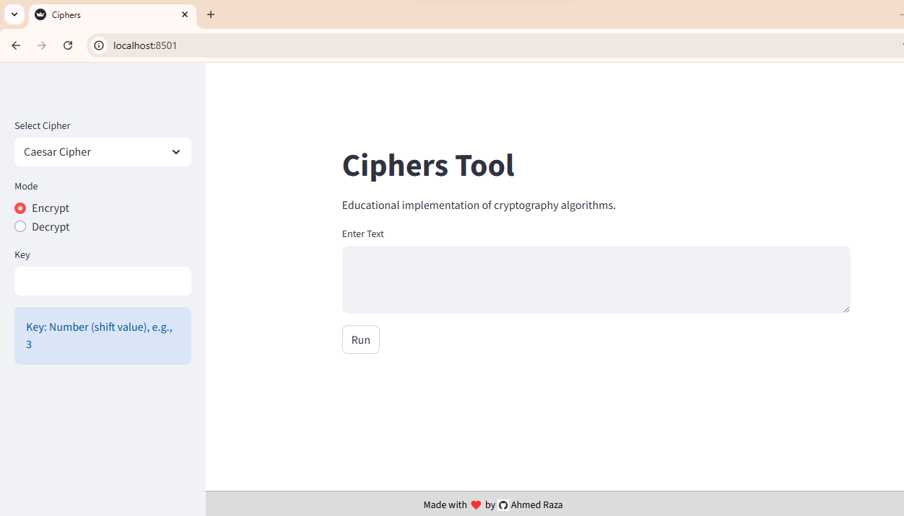
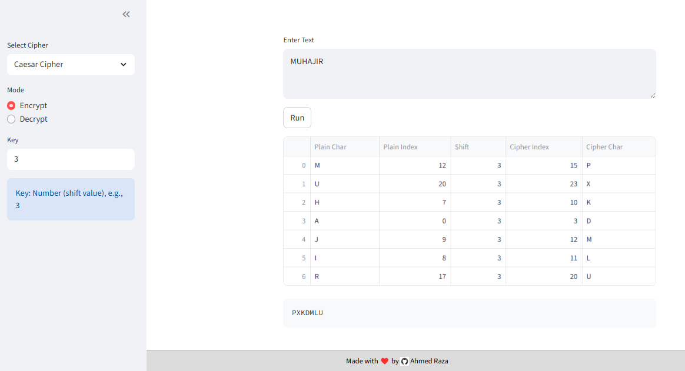
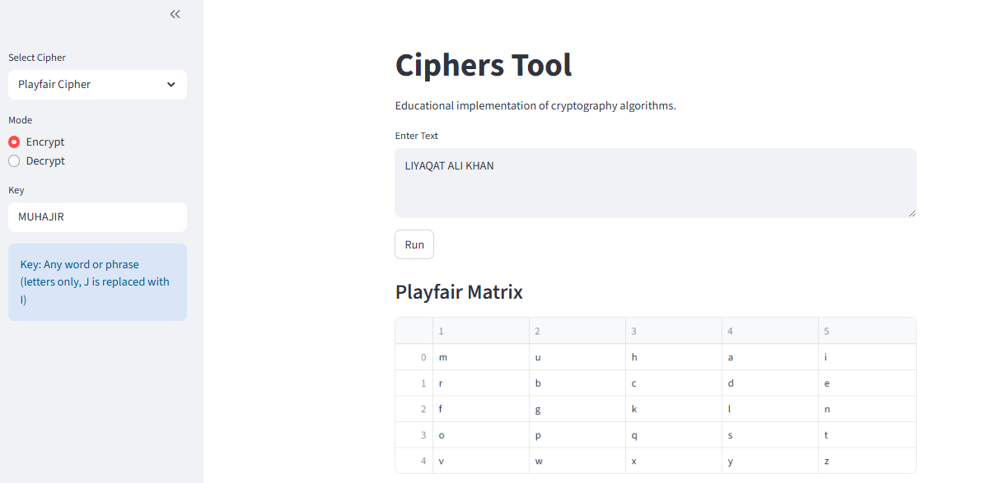
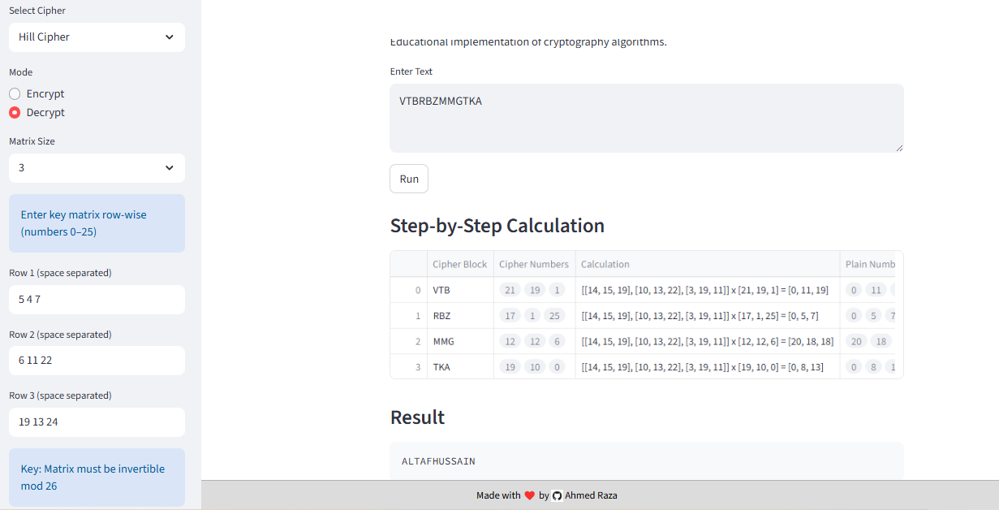
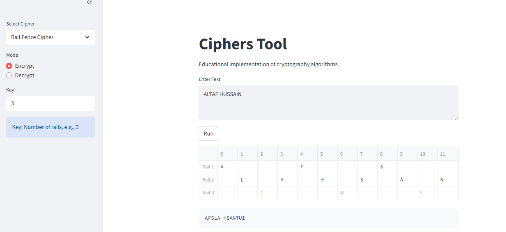
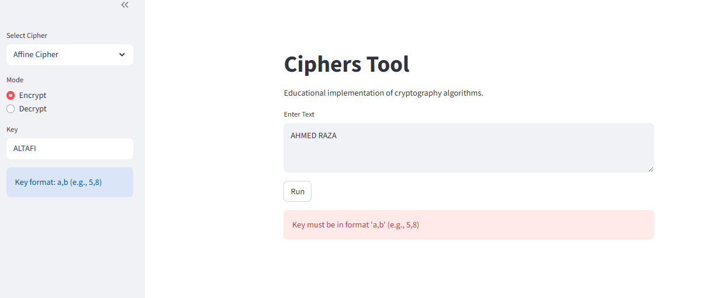

# 🔐 Classical Cryptography Simulator using Python & Streamlit

## Overview

This project is a complete **Classical Cryptography Simulator** built using **Python and Streamlit**.  
It allows users to **encrypt and decrypt text** using multiple classical ciphers while also showing **step-by-step calculation tables** for learning and academic understanding.

This is not a security product.  
This is a **learning tool** designed for students studying Cryptography, Information Security, or Computer Science.

---

## Why This Project Exists

Most cryptography tools only give you input and output.  
They hide the logic.

This project does the opposite.

It **exposes the internal working** of each cipher:
- character mapping
- key expansion
- matrix math
- padding rules
- intermediate tables

If you understand this app, you understand classical cryptography. No shortcuts.

---

## Features

- Encrypt and decrypt messages
- Supports multiple classical ciphers
- Automatic input cleaning and padding
- Step-by-step tables using Pandas
- Interactive UI using Streamlit
- Strong validation for keys and input
- Modular cipher architecture

---

## Implemented Ciphers

### Substitution Ciphers
- Caesar Cipher
- Monoalphabetic Cipher
- Affine Cipher

### Polyalphabetic Ciphers
- Vigenere Cipher
- Vernam Cipher
- Stream Cipher

### Transposition Ciphers
- Rail Fence Cipher
- Columnar Transposition Cipher
- Permutation Cipher
- Block Cipher

### Matrix-Based Cipher
- Hill Cipher (2×2 and 3×3)

### Digraph Cipher
- Playfair Cipher

---

## Tech Stack

- **Python 3**
- **Streamlit** (UI)
- **Pandas** (tables and dry runs)

No frameworks.  
No unnecessary libraries.  
Everything is visible and readable.

---

## Project Structure

```

Ciphers/
│
├── app.py
├── README.md
├── requirements.txt
│
└── screenshots/
├── home.png
├── caesar.png
├── playfair.png
├── hill.png
├── railfence.png
├── error.png
└── ciphers/
├── caesar.py
├── playfair.py
├── vigenere.py
├── railfence.py
├── affine.py
├── monoalphabetic.py
├── vernam.py
├── stream.py
├── blockcipher.py
├── columnar.py
├── permutation.py
└── hill.py

```

Each cipher is isolated in its own file.  
No spaghetti code.

---

## Installation

### Prerequisites
- Python 3.9 or above
- pip

### Install Dependencies

```

pip install -r requirements.txt

```

Contents of `requirements.txt`:
```

streamlit
pandas

```

---

## Running the Application

From the root directory:

```

streamlit run app.py

```

The app opens automatically in your browser.

---

## How the App Works

1. Select a cipher from the sidebar
2. Choose Encrypt or Decrypt
3. Enter plaintext or ciphertext
4. Enter the required key
5. Click Run
6. View:
   - final result
   - calculation tables
   - intermediate steps

If the key is invalid, the app stops immediately and explains why.

No silent failures.

---

## Key Formats (Important)

### Caesar Cipher
```

3

```

### Playfair Cipher
```

keyword

```
- Letters only
- J is replaced with I automatically

### Vigenere / Stream / Block / Columnar
```

KEY

```

### Rail Fence Cipher
```

3

```

### Affine Cipher
```

a,b

```
Example:
```

5,8

```
`a` must be coprime with 26 or encryption is rejected.

### Monoalphabetic Cipher
```

QWERTYUIOPASDFGHJKLZXCVBNM

```
Rules:
- Exactly 26 letters
- No duplicates
- A–Z only

### Vernam Cipher
```

KEYMATCHINGTEXT

```
Key length must match plaintext length (spaces ignored).

### Permutation Cipher
```

2,0,1

```

### Hill Cipher

- Matrix size: 2×2 or 3×3
- Values must be between 0 and 25
- Determinant must have a modular inverse mod 26

Example (2×2):
```

3 3
2 5

```

Invalid matrices are rejected instantly.

---

## Hill Cipher Internals

- Plaintext cleaned and padded using X
- Characters converted to numbers (A=0 … Z=25)
- Matrix multiplication shown step-by-step
- Determinant and modular inverse calculated
- Final ciphertext produced after mod 26

This cipher has the **most detailed dry run** in the project.

---

## 📸 Application Screenshots

### 1. Home Screen with Sidebar


### 2. Caesar Cipher Encryption with Table


### 3. Playfair Cipher 5×5 Matrix


### 4. Hill Cipher Matrix and Calculations


### 5. Rail Fence Cipher Zigzag Pattern


### 6. Invalid Key Error Message


---

## Academic Use

This project is suitable for:
- Cryptography labs
- Semester projects
- Demonstrations
- Viva preparation
- Teaching classical encryption

---

## Disclaimer

All implemented ciphers are **cryptographically weak**.  
They must **never** be used to protect real data.

This project exists only for **education and learning**.

---

## Author

**Ahmed Raza**  
GitHub: https://github.com/Ahmed-Raza-90

---

## Future Improvements

- Frequency analysis
- Cipher attacks
- Performance comparison
- Export tables as CSV
- Animated visualizations

---